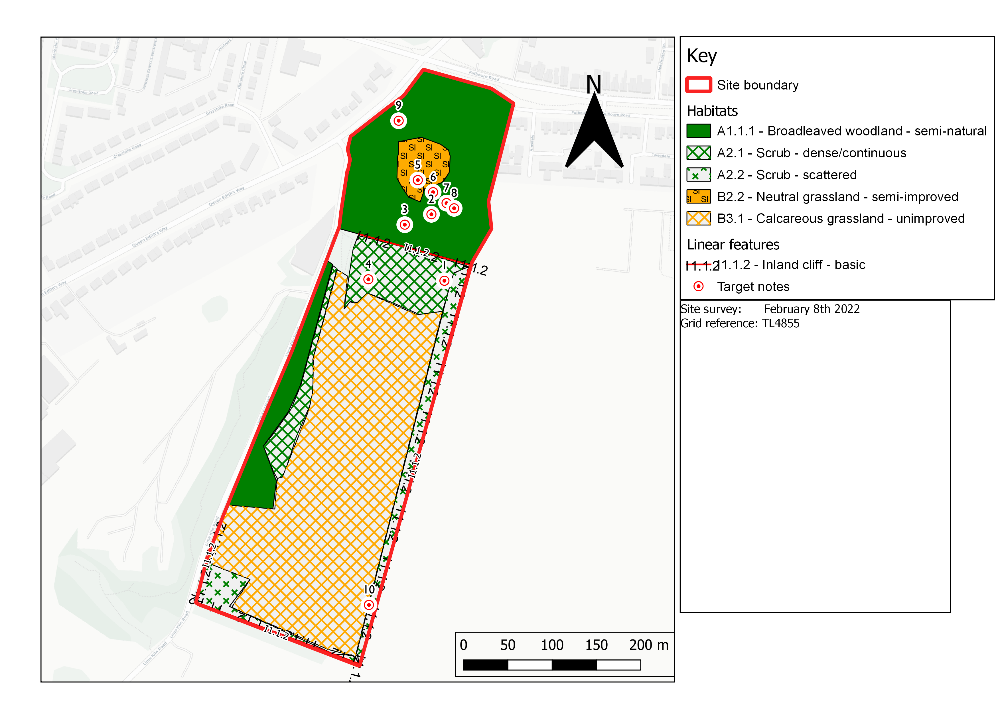

```{r setup, include=FALSE}
knitr::opts_chunk$set(echo = FALSE, cache = FALSE, warning = FALSE)
```

## Ecological value of the site

## Survey area

Cherry Hinton Chalk Pits (CHCP) covers 12 hectares on the South East side of Cambridge. It comprises 2 parts - the East Chalk Pit and Lime Kiln Close which together form a Local Nature Reserve. The LNR is managed by BCN Wildlife Trusts.

The East Pit is also part of Cherry Hinton Chalk Pit SSSI with the West Pit on the other side of Lime Kiln Road. The SSSI was designated in , on the basis of the presence of 4 rare plants found on the site - of which 3 are on the red list for plants. These are great pignut *Bunium bulbocastanum*, moon carrot *Seseli libanotis* and grape hyacinth *Muscari neglectum.* The other rare plant recorded is perennial flax *Linum perenne ssp. anglicum*.

Together with Wandlebury and the Gog Magog Downs, Cherry CHCP is part of the Cambridge Living Chalk Landscape, an interconnected series of chalk grasslands to the South East of Cambridge. 2km area includes Wandlebury and Gog Magog.

## Desktop research

I used the data from NBN Atlas @nbnatla, DEFRAs MAGIC service, and Cambridgeshire and Peterborough Environmental Records Centre to assess taxa observed within a 2km radius of the site.

## Habitat survey

The survey was conducted by a site visit on 8th February 2022 - not able assess flowering plants or breeding birds.

The dominant landscapes are broadleaf woodland which forms x% of Lime Kiln Close and calcareous grassland in the East Pit. The pit is surrounded by chalk cliffs edged by scattered scrub and dense scrub and broadleaf woodland along the Lime Kiln Boundary

A map of the habitat is shown in fig...

The broadleaf woodland is dominated by Ash *Fraxinus excelsior* and Field Maple *Acer campestre.* Mature ash trees are also scattered amongst the dense scrub.

NBN atlas lists 1044 species observations within 2km of the Chalk Pits

### Species within 2km

```{r}

library(pacman)
p_load(tidyverse, glue, sf, here)

data <- read_csv(glue(here("data"), "/records-2022-02-17.csv"), show_col_types = FALSE)


data_1 <- data %>%
  janitor::clean_names() 
```

```{r}

  
sp <- data_1  %>%
  filter(between(start_date_year, 2010, 2019)) %>%
  count(start_date_year, class, family, scientific_name, common_name) %>%
  pivot_wider(names_from = "start_date_year", 
              values_from = "n", 
              values_fill = 0) %>%
  mutate(id = row_number()) %>%
  select(id, everything()) %>%
  arrange(class) 

#sp %>% DT::datatable()

protected_species <- c(1, 4, 8, 9, 14, 22, 30, 32, 35, 38, 41, 53, 56, 69, 75, 83, 94, 98, 99, 100, 
                       102, 103, 270, 258, 403, 356, 92
                       )

sp_prot <- sp %>%
  filter(id %in% protected_species) %>%
  select(common_name, scientific_name, `2010`:`2019`)

sp_prot %>%
  knitr::kable()

```

```{r, eval = FALSE}
library(ggspatial)

params$species
data_1 %>%
  st_as_sf(coords = c(x = "longitude_wgs84", y = "latitude_wgs84"), crs = 4326, agr = "constant") %>%
  filter(str_detect(common_name, params$species),
         start_date_year >= 2000) %>%
  ggplot() +
  annotation_map_tile(zoomin = 0) +
  geom_sf(aes(colour = factor(start_date_year))) +
  coord_sf() +
  ggtitle(params$species) +
  viridis::scale_color_viridis(option = "turbo", discrete = TRUE)

```

### Phase-1 Habitat Map

{height=1200, width=1200}

### Target notes

```{r}

library(here)

here <- here()

csv <- list.files(paste0(here, "/data/Cherry Hinton CP"), pattern = ".csv", full.names = TRUE) %>%
  read_csv()

csv %>%
  arrange(fid) %>%
  select(Note = fid, Description = Title, x = xcoord, y = ycoord) %>%
  mutate_at(.vars = c("x", "y"), round, 4) %>%
  knitr::kable()

```


## Ecological impact of development

### Bats

Noctule *Nyctalus noctula,* Pipistrelle *Pipistrellus pipistrellus* and Soprano Pipistrelle bats *Pipistrellus pygmaeus,* have been observed in the surrounding area and the woodland provides potential roosting sites. Bats are protected under the Wildlife and Countryside Act 1981, and Annex IV of the European Habitats Directive.

It is recommended that a bat survey be conducted...

### Birds

A number of protected bird species frequent the site or have been well recorded in the surrounding area. During the field visit, House sparrows *Passer domesticus* were noted in the wooded area and Greenfinch *Chloris chloris*  was heard singing in the dense scrub at the north end of the chalk pit. Greenfinch is now a red-listed species. @stanbury2021

The full list of protected species potentially nesting in the area and surrounding fields is shown in the table.

### Mammals

During the site visit I found evidence of a (probably inactive) badger sett. Badgers *Meles meles* are protected by the Protection of Badgers Act 1992. Although there are no records of badgers it is recommended ....

Hedgehogs *Erinaceous europaeus* are also found in the area and are protected under the Wildlife and Countryside Act (schedule 6).

There have been European Water Vole sightings along Cherry Hinton Brook - a chalk stream 

### Plants

### Bryophytes

The survey site is well known for its variety of mosses (Bryophetes) and lichens with over 150 species noted. In particular the Chalk screw-moss *Tortula vahliana* has been recorded and the pits are one of very few sites in England where this rare moss is found.[^1]

### Scoping matrix

### Scientific rationale for impacts

## References

[^1]: <https://species.nbnatlas.org/species/NHMSYS0000310798>
